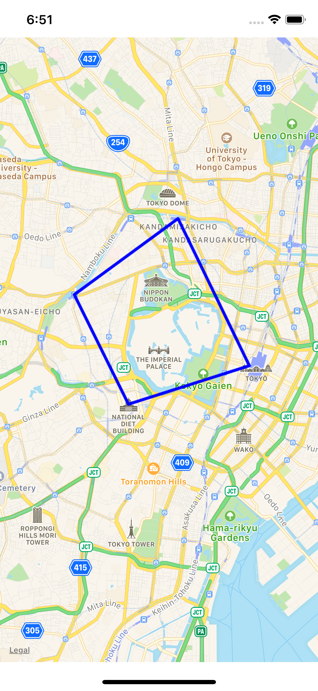

# MapViewに軌跡を引くサンプルコード



## MKmapViewに軌跡を引くポイント

### Step1.線を結ぶ位置をMKPolinelineでインスタンス化する

CLLocationCoordinate2D型の位置を配列として`MKPolyline`でインスタンス化します。

```
let coordinates = [pos1 , pos2]
let polyLine = MKPolyline(coordinates: coordinates, count: coordinates.count)
```

### Step2.MKMapViewにMKPolinelineインスタンスをaddOverlayする
MKMapViewにaddOverlayします

```
mapView.addOverlay(polyLine)
```

### Step3.MKMapViewDelegateメソッドで線の色と太さを指定する
addOverlayするとMKMapViewDelegateメソッドが呼ばれます。
delegateメソッド内に線の色と太さを指定します。

```
func mapView(_ mapView: MKMapView, rendererFor overlay: MKOverlay) -> MKOverlayRenderer {
    if let polyline = overlay as? MKPolyline {
        let polylineRenderer = MKPolylineRenderer(polyline: polyline)
        polylineRenderer.strokeColor = .blue
        polylineRenderer.lineWidth = 2.0
        return polylineRenderer
    }
    return MKOverlayRenderer()
}
```
